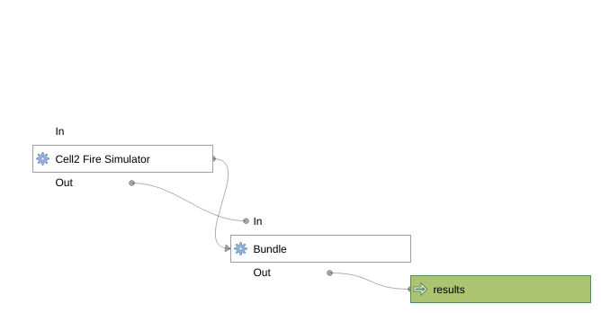

# QGIS Graphical Models

"... When working with a GIS, most analysis operations are not isolated, rather part of a chain of operations. Using the model designer, that chain of operations can be wrapped into a single process, making it convenient to execute later with a different set of inputs. No matter how many steps and different algorithms it involves, a model is executed as a single algorithm, saving time and effort." (taken from QGIS user manual)

## Samples
1. Simulate & Load All `SimulateLoad.model3`
This model automates simulating with loading its results to the user interface afterwards.  
Make sure to:
- Configure the proper layers
- Configure the desired outputs (Propagation DiGraph and Scars can be slow for many or lengthy simulations), 
- There's a special confirmation checkbox to graphically load the Propagation DiGraph because it can get so slow.
- Don't simulate into temporary folders (the model is saved with both helper checkboxes that creates the instance in the project folder, so have a project locally saved)

2. Risk metrics dependant on Propagation DiGraph `RiskMetricsDependentOnPropagationDiGraph.model3`
By simulating with the "Propagation Directed Graph" output option enabled, the simulator writes a "Messages" folder with "MessagesFiles .csv" text-file for each simulation, where each line is an 3-tuple representing an edge weighted by simulation time (from-cell,to-cell,fire-hit-time).

To view this in QGIS use the "Propagation DiGraph" algorithm, that transform each 3-tuple into an arrow in a Vector Layer and also stores the files in a more efficient way (pickled numpy array). This pickled file is then used by both "Betweenness Centrality" and "Downstream Protection Value".  

You can open, configure and run: `RiskMetricsDependentOnPropagationDiGraph.model3` to do this in a pipelined way.

## References
- https://docs.qgis.org/latest/en/docs/user_manual/processing/modeler.html
- https://www.geeksforgeeks.org/whats-data-science-pipeline/
- https://gis.stackexchange.com/questions/329323/qgis3-call-model-from-windows-path-with-python-script
